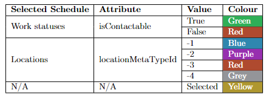

# Visual Whereabouts

## Introduction

This application was developed to replace the SharePoint Lists whereabouts. It allows its users to view the upcoming schedules of their co-workers. Users can either view a timeline containing the scheduled work statuses or locations of their co-workers and make changes to scheduled events from the timeline via an update modal.
The application is built for a desktop environment but features responsive components that will provide a mobile-friendly user experience.

## Scripts

While in the project directory:

### `npm start`

Runs the app in the development mode.\
Open [http://localhost:3000](http://localhost:3000) to view it in your browser.

The page will reload when you make changes.\

### `npm run build`

Builds the app for production to the `build` folder.\
It bundles the code in production mode and optimizes the build for the best performance.

The build is minified and ready to be deployed.

## WhoWhatWhere API

The application sources all of its data from the WhoWhatWhere API, which bridges the gap between the application and a SQL database holding all the data required to run the application.

All of the content is dynamically loaded. If the hierarchy contents changes in the database, that will be reflected in the application after a refresh.

## Routes used

Below is a list of the API routes used by the application. The application will handle changes such as the extra attributes being returned, but it will not tolerate attributes being removed; this should be taken into consideration if altering the existing routes in the API.

- `/api/persons/`
- `/api/persons/<id>`
- `/api/teams/<id>/all`
- `/api/locations/<id>/all`
- `/api/teams/hierarchy`
- `/api/teams/locations`
- `/api/persons/<id>/workstatus/all`
- `/api/persons/<id>/locations/all`
- `/api/persons/<id>/locations/<locationID>/range/<startDTM>/<endDTM>`
- `/api/persons/<id>/workstatus/<locationID>/range/<startDTM>/<endDTM>`

## IP Whitelisting

For the time being, only traffic originating from a Bluesmith IP address is accepted by the API, meaning that if you run the application locally or connect to the deployed version, it will not render any data, and you will be presented with a "Failed to load hierarchies" message.

To rectify this, ensure you are on the BIS network (not the guest network) either physically or remotely via your VPN.

## Changing the Base URL of the API

[Axios](https://axios-http.com/docs/intro) is used to handle all requests to the WhoWhatWhere API. For simplicity, a single Axios instance is declared in a file called `/src/api.js`. To point the application at a different location alter the value of the `baseURL` attribute in the format:
`https://<baseURL>`

Do not put a `/` at the end of the URL, or include the `/api` route as part of the baseURL.

## Timeline item colouring

The colours of an item depend on the values of the attributes provided in the table below:

## Contributing

Anyone is welcome to contribute to this project. Either create a backlog item for a feature you would like to see in the future, or if you would rather attempt to implement the feature yourself, then create a new branch off master with the following format `/feature/<initials>/<workitemID>_<Short name>`.

Create a pull request and assign two active developers to review your code once the work has been completed.
If approved, the code changes will deploy to the live version of the application automatically shortly after the merge.
